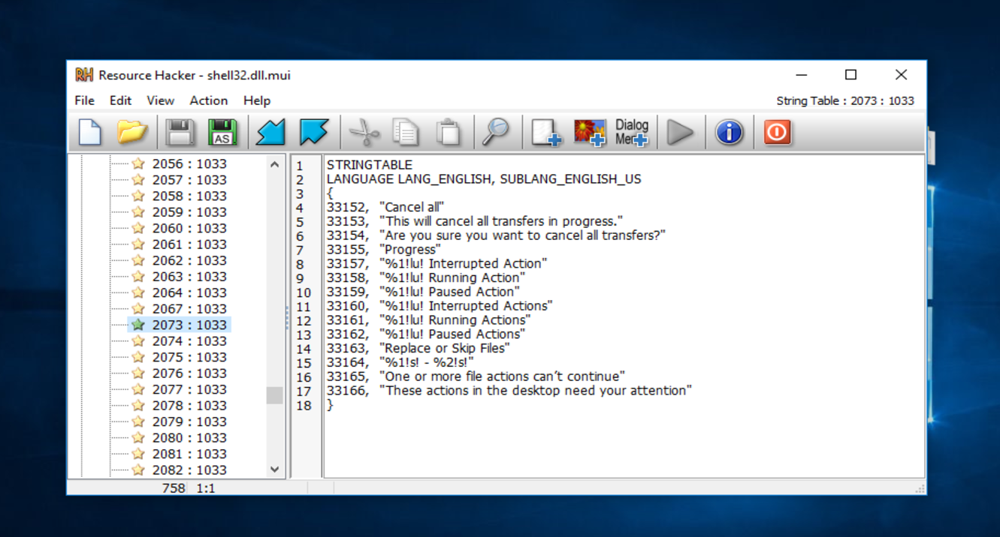

# Cuid 
# Avoiding Detection/Hidden Process's & System wide changes with .mui file's. 
# Tech
mui files are are application extentions, that serve's as a local data base for a dll or an executable,  
despite the fact that those are not executable files they, at a big extent influance existing application's activety.  
One biggie for any spyware/adware is avoiding detection, while any respectfull rootkit would operate from ring 0, To hide its existance at an infected machine.  
it is very well common for rootkits & Rats to change Critical Structures at NtosKrnl for hiding one existance from the user operating the target machine.  
# and in this Repo i would concentrate at disabling Ci, while hiding that from the user, but the extent of changing mui files to "customize" the Ui, can go much further (and would not requere the machine to be 'safeboot disabled') as this poc do.
Well, as i have witness, this may be absolute, as there is an easyier work-around.  
while Code Integrity (S.T CI (ci.dll)) was introduced as far back from vista, it is Only a Security feature That Can be bypassed by simply running:  
bcdedit /set testsigning on 
but guess what, you got a big sign infront of the user saying (TEST MODE), well we didnt do that much if so, cuz the opertunity to control the target system from ring 0 (as i see it) will allow you to better hide your activty (cuz afaik if your a good enof coder there is almost nothing you cannot implement as a spyware go's with user mode and priv). 
So what a great thing could be for a malware author to just remove this sign (i am aware that there are different ways to disable Ci w/o that but that requeres some pg manipulation, and i will focus on this finding alone in this repo.). 
# Well looks like MS got it all figured Out... (mmmmm)  not really.
like almost everything at the windows os it all comes down to a few veriables sitting at some exe (Ntos) or dll memory, or evan far better a simple text file (Mui). 
looking at shell32.dll.mui (well shell 32 hold almost every aspect of the user it is the "shell" wrapper) with <html><a href="http://www.angusj.com/resourcehacker/">resHacker</a></html>

you can see many interesting things (you can with notepad also...),
guess what.... "TestMode" simply sits there as a veriable. well very easy if test signing is on then when shell32.dll is initialized it goes to table 2069 (not really depand on the vertions but this do not make any differance as you will see further on).
# Well what will heapen if we simplly delete "TestMode"?????
well the answer is nothing, well (besides the fact that the sign is now off), but hey guess what
